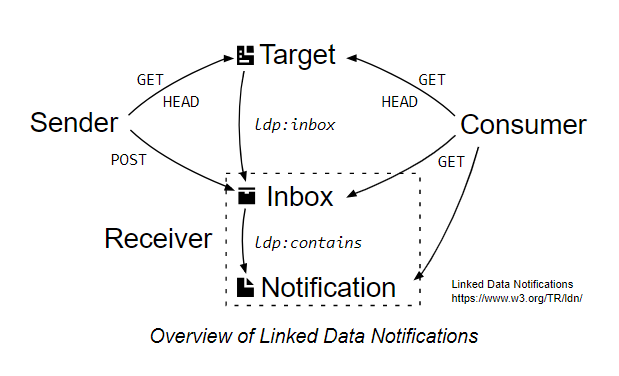

# ldn-target-showcase
This project is a simple [Linked Data Notification](https://www.w3.org/TR/ldn/) target implementation to test and showcase all options:



It is a [node.js](https://nodejs.org/) ([express](https://expressjs.com/)) app.

## Requirements
You need to install [node.js](https://nodejs.org/) (with included [npm](https://www.npmjs.com/get-npm)).

## Install
Run the following command in the **module's root folder**:
```bat
npm install
```
It installs all project dependencies, for details see https://docs.npmjs.com/cli/install.

## Run
Run with
```bat
npm start
```
Application is listening on the port 3000.

## Usage
Open browser at http://localhost:3000/. You can see all the options to try out. Use e.g. curl or Postman to make HTTP request with various options.

For example this request: 
```
GET /content HTTP/1.1
Accept: application/ld+json
Host: localhost:3000
```
gets this response:
```
HTTP/1.1 200 OK
Content-Type: application/ld+json; charset=utf-8
{
    "@context": "http://www.w3.org/ns/ldp",
    "@id": "https://tonda.solid.community/",
    "inbox": "https://tonda.solid.community/inbox/"
}
```

### Swagger documentation
https://app.swaggerhub.com/apis-docs/WhyINeedToFillUsername/ldn-target/0.1
